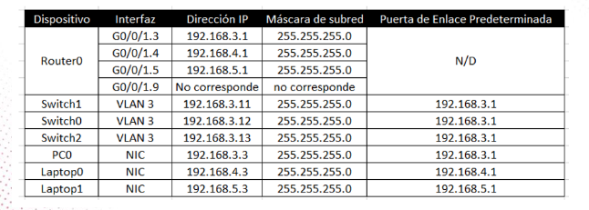
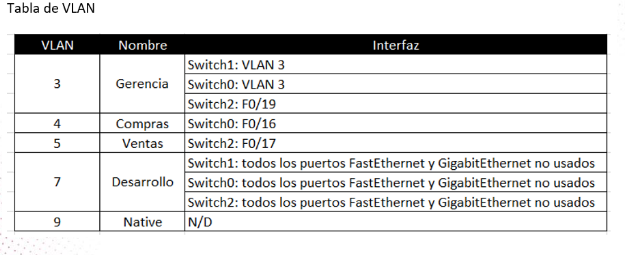
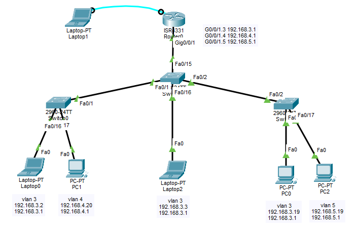
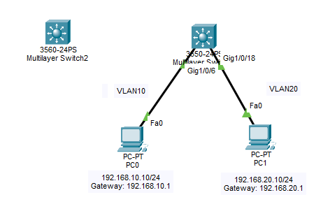

# S2 - Enrutamiento interVLAN

## Opciones para conectar VLANs entre si

Las VLANs estan aisladas en capa 2. Para que se comuniquen se necesita un dispositivo de capa 3. Hay dos formas principales de hacerlo.

Para la implementación práctica del ejercicio ver `session 1/separacion_areas_con_vlan.md`.

---

## 1. Router-on-a-stick

Un router fisico conectado a un switch mediante un solo cable trunk. El router usa subinterfaces, una por cada VLAN.

### Topologia







### Configuracion del router

```bash
interface GigabitEthernet0/0
 no shutdown

interface GigabitEthernet0/0.10
 encapsulation dot1Q 10
 ip address 192.168.10.1 255.255.255.0

interface GigabitEthernet0/0.20
 encapsulation dot1Q 20
 ip address 192.168.20.1 255.255.255.0

interface GigabitEthernet0/0.30
 encapsulation dot1Q 30
 ip address 192.168.30.1 255.255.255.0
```

### Configuracion del switch

```bash
interface gig0/1
 switchport mode trunk
 switchport trunk allowed vlan 10,20,30
```

### Ventajas y desventajas

| Ventaja | Desventaja |
|---------|------------|
| No se necesita switch capa 3 | El router puede ser cuello de botella |
| Facil de configurar | Trafico interVLAN cruza por un solo cable |
| Economico | Si el router falla, se corta el ruteo |

---

## 2. SVI (Switched Virtual Interface)

Interfaz virtual dentro de un switch capa 3. El mismo switch hace el ruteo entre VLANs, sin router externo.



### Configuracion del switch capa 3

```bash
vlan 10
 name Sistemas

vlan 20
 name Ventas

interface g1/0/6
 sw mode access
 sw access vlan 10

interface g1/0/18
 sw mode access
 sw access vlan 20

exit 

interface vlan 10
 ip address 192.168.10.1 255.255.255.0
 no shutdown

interface vlan 20
 ip address 192.168.20.1 255.255.255.0
 no shutdown

exit

 ip routing
```

### Ventajas y desventajas

| Ventaja | Desventaja |
|---------|------------|
| Mas rapido que router-on-a-stick | Requiere switch capa 3 (mas caro) |
| Todo en un solo equipo | Mayor costo |
| Menos cables | Configuracion mas avanzada |

---

## Comparacion directa

| Caracteristica | Router-on-a-stick | SVI |
|----------------|-------------------|-----|
| Dispositivo | Router externo | Switch capa 3 |
| Comando clave | `encapsulation dot1Q X` | `interface vlan X` |
| Habilitar ruteo | No aplica | `ip routing` |
| Cableado | Un trunk al router | Todo interno |
| Escalabilidad | Media | Alta |

---

## Reglas de oro

1. Sin router o SVI, las VLANs no se comunican entre si.
2. Con router-on-a-stick, el puerto del switch hacia el router debe estar en modo trunk.
3. Con SVI, el switch debe soportar capa 3 y debe ejecutar `ip routing`.
4. Cada PC debe tener como gateway la IP de la subinterface o SVI de su VLAN.

---

## Comandos de verificacion

```bash
show ip interface brief
show ip route
show vlans
ping [ip-destino]
```
